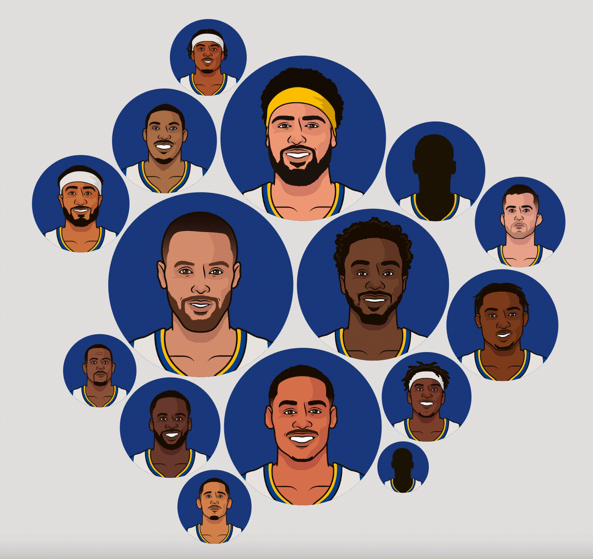

# NBA Visualizer

## Description
[NBA Visualizer](https://alexmalos.github.io/NBA-visualizer/) is a way to easily view statistics for NBA players and compare their stats to those of their teammates. Data is rendered in a bubble chart that shows each player on a given team as a bubble with the size of the bubble corresponding to the player's performance in the stat that is being viewed. Information about the selected team is shown next to the chart. All data is sourced from [StatMuse](https://statmuse.com) and is available for every team, from 2022 going all the way back to the founding of the NBA in 1947.

## Features
Users are able to select the team and the season that they want to see, and the chart will load in with an animation.


They are also able to select from multiple options that dynamically resize the bubbles and rearrange the chart when changed:
- Statistic (points, rebounds, assists)
- Regular season or playoffs
- Mode (per game, per 36 minutes, totals)
- Minimum games played (ranging from 1 to the most games played by a player on the team)


Users are able to hover over each bubble on the chart to see the name of the player and the actual number they put up for the relevant stat. These bubbles are also clickable, and take the user to the StatMuse page for whichever player they clicked on.


  
## Code Snippets
```javaScript
const response = await fetch(
    `https://*****-proxy.herokuapp.com/https://api.statmuse.com/teams/v2/nba/${teamId}/${year}/player-stats?params%5BplayerStatsBreakdown%5D=${mode}`
);
let data = await response.json();

if (data.grids.length > 1 && data.grids[1].name === "Play-In Tournament") data.grids.splice(1, 1);

data = data.grids.map(obj => obj.rows);

if (data.length > 1) {
    data[1] = data[0].map((player) => {
        const i = data[1].findIndex(el => el.PLAYER.display === player.PLAYER.display);

        if (i === -1) {
            return {
                "GP": { "value": 0 },
                "PLAYER": { "display": "zzz" }
            };
        }

        return data[1][i];
    })
}
```
JSON data is fetched from the StatMuse API through a proxy server to avoid CORS (Cross-Origin Resource Sharing) restrictions. Play-In Tournament stats are removed and then the data is turned into an array containing only the necessary information. If playoff stats are present, that data is structured and sorted to match the regular season data, necessary to maintain visual consistency in the chart when switching between regular season and playoffs. 

```javaScript
const nodes = d3.pack()
    .size([width, height])
    .padding(5)(d3.hierarchy({ children: data[dataIndex] })
        .sum(d => {
          if (d[stat] && d.GP.value >= minGames) return d[stat].value;
        })
    )
    .children;
```
D3's pack function is used to generate an array of nodes that contain the layout info for each data point.

```javaScript
const svg = d3.select('#bubble-chart')
    .style('width', width)
    .style('height', height);

svg.selectAll('*').transition().duration(600).style('opacity', 0).remove();

const groups = svg.selectAll()
    .data(nodes)
    .enter().append('g')
    .attr('transform', `translate(${width / 2}, ${height / 2})`)

groups.append('circle')
    .style('fill', colors[0])
    .classed('circle', true);

groups.append('image')
    .attr('x', d => d.r * -1.25)
    .attr('y', d => d.r * -1.25 + d.r / 6.8)
    .attr("width", d => d.r * 2.5)
    .attr("height", d => d.r * 2.5)
    .attr('href', d => d.data.PLAYER.imageUrl)
    .attr('clip-path', d => `circle(${d.r} at ${d.r * 1.25} ${d.r * 1.25 - d.r / 6.8})`);
```
The SVG element is selected and any children it may have are faded out and then deleted (this clears the old chart before rendering a new chart). The SVG is then populated with `<g>` elements, which are containers to group other SVG elements. Each group is assigned the data for the corresponding element in the nodes array and positioned in the middle of the SVG (an animation is later applied that moves them to the positions they should be at). A circle element and an image element are then added as children to each group element. The circles are filled with the primary team color and the images are positioned over the circles and linked to the image of the player for that data point.

## Technologies, Libraries, APIs
This project utilizes:
- vanilla JavaScript
- HTML5/SCSS
- the D3 library to create data visualizations
- the StatMuse API to fetch the necessary data
- Webpack to compile the JavaScript code
- npm to manage project dependencies

## Future Considerations:
- Change team name and display colors to reflect historical iterations of a team (e.g. the Memphis Grizzlies would show as the Vancouver Grizzlies when looking at a season prior to 2001-02)
- Allow users to click on players shown in charts and go to a stat page for that specific player