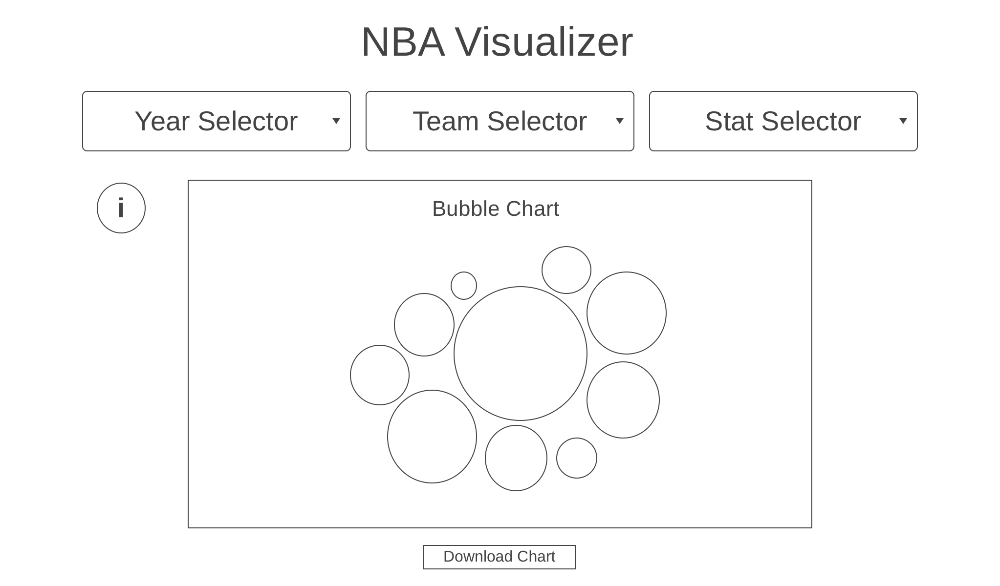

# NBA Visualizer

## Background
This app is intended to be a visually appealing way to view statistics for NBA players. Data is rendered in a bubble chart that shows each player as a bubble with the size of the bubble corresponding to the player's performance in the stat that is being viewed. Data is sourced from StatMuse and will be available for every team as well as league-wide, from 2022 going all the way back to the founding of the NBA in 1947.

## Functionality & MVPs
With this NBA visualizer, users will be able to:
- Select which visualization to see by year, team, and statistic
- See an animated bubble chart showing the specified stat for players in relation to their teammates or the whole league
- Each bubble contains a player headshot and can be enlarged on hover to show details
- Download the current chart as a PNG
  
In addition, this project will include:
- A popup on page load that shows general background and instructions for use
- An info button that shows details about the season for whichever team is selected 
- A production README
  
## Wireframes

## Technologies, Libraries, APIs
This project will be utilizing:
- the D3 library to create data visualizations
- the StatMuse API to fetch the necessary data
- Webpack to compile the JavaScript code
- npm to manage project dependencies

## Implementation Timeline
  * Friday Afternoon & Weekend: Figure out how to make animated and interactive bubble chart using D3 with JSON data
  * Monday & Tuesday: Make HTML shell and selectors that can fetch the necessary data and render it properly
  * Wednesday: Implement styling and touch up animations and other things if necessary
  * Thursday Morning: Deploy onto GitHub and Heroku

## Bonus Features:
- Allow users to click on players shown in charts and go to a stat page for that specific player